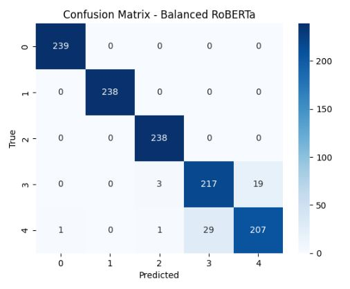
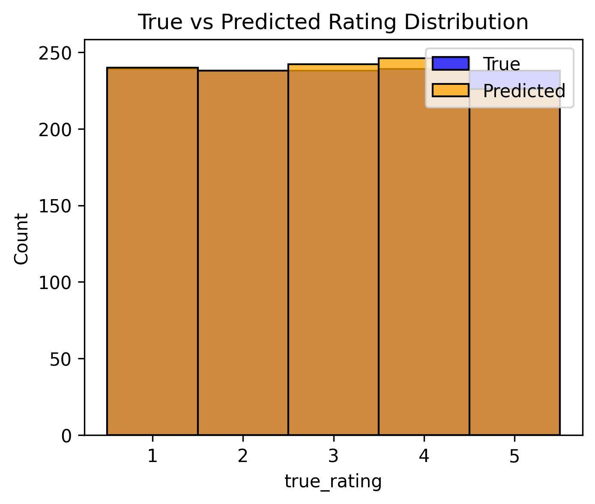

# AI-Powered Amazon Review Rating Predictor
### NLP • Transformers • Data Engineering • PostgreSQL • Python

This project builds an end-to-end **AI pipeline** that predicts **Amazon review star ratings (1–5)** using a fine-tuned **RoBERTa transformer model**.  
It combines **data engineering, machine learning, and NLP** to turn raw text reviews into **actionable customer insights**.

---

## What This Project Does

### 1. **Data Engineering (PostgreSQL)**
- Designed a relational database for products, customers, and reviews  
- Imported and cleaned large-scale Amazon review datasets  
- Joined tables and prepared a unified dataset for modeling  
- Exported a clean ML-ready file (`final_dataset.csv`)

---

### 2. **Exploratory Data Analysis (Python)**
- Checked rating distribution, review length patterns, and data quality  
- Identified heavy class imbalance (majority ★5 reviews)  
- Evaluated relationships between text structure and rating outcomes  

---

### 3. **Feature Engineering**
- Prepared text data for NLP modeling  
- Applied oversampling to balance classes (critical for model performance)  
- Added optional sentiment signals and category/brand features  

---

### 4. **NLP Modeling (RoBERTa Transformer)**
- Fine-tuned `roberta-base` on oversampled data  
- Used Google Colab GPU for training  
- Applied early stopping, learning rate scheduling, and evaluation strategy  
- Exported predictions + confusion matrix + performance metrics  

---

### 5. **Analysis & Insights**
Generated insights from the AI model, such as:
- Prediction accuracy and macro F1 score  
- Most common misclassifications  
- Differences between true vs predicted rating distributions  
- Which brands/categories tend to receive higher predicted satisfaction  
- Insights saved as reproducible scripts + PNG visualizations  

---

### 6. **Reporting**
The project includes:
- Confusion matrix (model strengths/weaknesses)  
- Rating distribution analysis  
- Performance over epochs  
- Business-oriented insights (brand, category, sentiment trends)

All visuals are available inside the reports/ folder.

---

## Tech Stack

**Languages:** Python, SQL  
**Database:** PostgreSQL  
**ML/NLP:** RoBERTa, HuggingFace Transformers, PyTorch, scikit-learn  
**Data Engineering:** SQLAlchemy, Pandas  
**Tools:** VS Code, Google Colab, Jupyter  
**Visualization:** seaborn, matplotlib  

---

## Why This Project Matters (The Business Need)

In today's market, customer reviews are a goldmine of data. But for most companies, this data is "dark", it's collected but never analyzed. Why?

* **Scale:** Manually reading millions of reviews is impossible.
* **Nuance:** Simple keyword searches (e.g., "bad") can't tell the difference between a 1-star "This is bad" and a 4-star "Not bad at all!"
* **Imbalance:** Most reviews are either 5-star or 1-star, so models get lazy and learn to ignore the 2, 3, and 4-star opinions that contain the most constructive criticism.

This project tackles all three problems. It builds an automated, intelligent system that can read, understand, and classify **all** of your customer feedback, unlocking the insights hidden in the text.

## Real-World Applications (What This Solves)

This isn't just an academic model; it's a tool that businesses can use to:

* **Identify Product Flaws Instantly:** Automatically flag any product receiving a sudden surge of 1-star or 2-star reviews. This allows engineering teams to find and fix bugs or quality issues in real-time.
* **Prioritize Customer Service:** Triage all 1-star reviews and route them directly to a customer support-retention team for immediate follow-up, helping to save unhappy customers.
* **Find Your "Magic" Keywords:** Analyze the exact phrases and features mentioned in 5-star reviews. This tells the marketing team precisely what to highlight in new ads and product descriptions.
* **Benchmark Competitors:** Run a competitor's Amazon reviews through the same model to get an unbiased, data-driven look at their strengths and weaknesses compared to your own.

## 🧩 The Tech Stack: A Deeper Look

This project's tech stack was chosen to mirror a modern, production-ready data science workflow.

* **Data Engineering (PostgreSQL & SQLAlchemy):** We start with a relational database, not a flat `.csv`. This simulates a real company's data warehouse and allows for scalable, complex data joins and prep.
* **NLP / Deep Learning (HuggingFace RoBERTa):** We use a powerful **Transformer** (RoBERTa) because it understands the *context* and *nuance* of language. Unlike simpler models, it can tell the difference between "I'm not happy" and "I couldn't be happier!"
* **ML Pipeline (Pandas & Scikit-learn):** Used for robust data cleaning and, most importantly, **oversampling**. This strategy directly fights the class imbalance problem, teaching the model to pay just as much attention to rare 2-star reviews as it does to common 5-star ones.
* **Training & Reporting (Google Colab & Seaborn):** The model is fine-tuned on a high-performance GPU in Google Colab for speed. All results are saved as clear, business-ready plots (like the confusion matrix) that tell a story.

## Key Results

- **Balanced RoBERTa model accuracy:** ~96%  
- **Macro F1 score:** ~0.95  

Here is the model's performance on the test set. The confusion matrix shows a strong ability to distinguish between all five-star ratings, with most errors being only one star off.

The distribution of the model's predicted ratings also closely matches the true (oversampled) rating distribution.

- Significant performance improvement after oversampling  
- Strong alignment between predicted and true rating distributions  
- Model successfully captures sentiment patterns in text reviews

---

## Project Purpose

This project demonstrates an end-to-end real-world workflow for a **Data Analyst / ML Engineer**:

- SQL-based data modeling  
- Python EDA + feature engineering  
- NLP model training on GPUs  
- Insights generation for business decision-making  
- Clean, reproducible, production-ready structure  

---

## Author

**Atharva Deshmukh**  
M.S. Computer Science, Stevens Institute of Technology  
GitHub: https://github.com/Atharva2901  
LinkedIn: https://www.linkedin.com/m/in/atharva-deshmukh-0968751a6/

